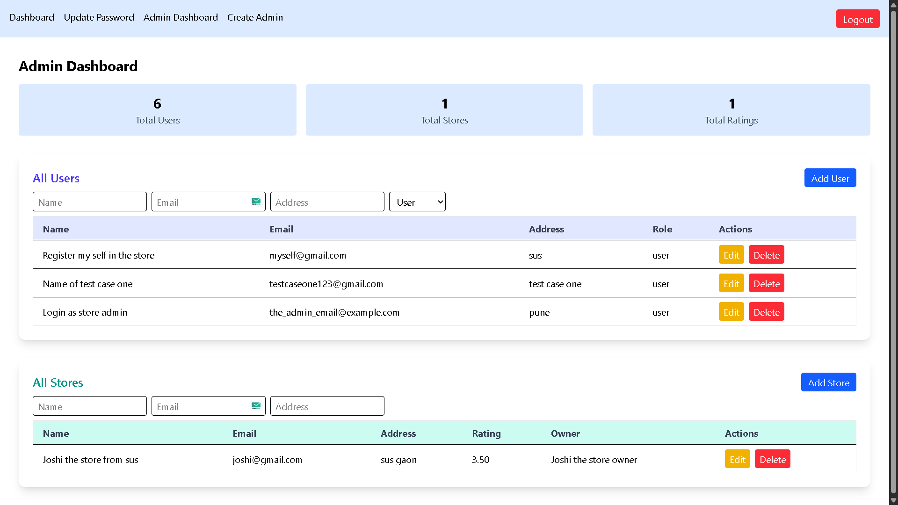

# RateMyStore - Store Rating System




A full-stack web application for rating stores with role-based access control.

## 🛠️ Tech Stack

### Backend
- **Node.js** with Express.js
- **PostgreSQL** database
- **Sequelize** ORM
- **JWT** authentication
- **bcrypt** for password hashing

### Frontend
- **React.js 18** with Vite
- **TailwindCSS** for styling
- **React Router** for navigation
- **Axios** for API calls

## 🚀 Quick Start

### 1. Clone the Repository
```bash
git clone <repository-url>
cd RateMyStore
```

### 2. Setup Database
Create a PostgreSQL database and update the `.env` file in `Back-end/`:

```env
DB_HOST=localhost
DB_USER=your_username
DB_PASSWORD=your_password
DB_NAME=ratemystore
DB_PORT=5432
PORT=5000
JWT_SECRET=your_secret_key
```

### 3. Install Dependencies
```bash
cd Back-end
npm install

cd ../Front-end
npm install
npm install react-router-dom
```

### 4. Start the Application
```bash
cd Back-end
npm start

cd Front-end
npm run dev
```

### 5. Create Admin User
1. Go to `http://localhost:5173/register`
2. Register a new user (any role)
3. Access your PostgreSQL database
4. Update the user's role to 'admin':
```sql
UPDATE "Users" SET role = 'admin' WHERE email = 'your_email@example.com';
```

### 6. Access Admin Dashboard
1. Login with your admin credentials
2. Navigate to Admin Dashboard
3. You can now:
   - Create/Manage Users
   - Create/Manage Stores
   - View system statistics

## 📋 Features

### Admin Dashboard
- User management (Create, Edit, Delete)
- Store management (Create, Edit, Delete)
- System statistics
- Role-based access control

### User Dashboard
- Browse stores
- Rate stores (1-5 stars)
- Search and filter stores
- View personal ratings

### Store Owner Dashboard
- View owned stores
- See ratings and analytics
- Monitor store performance

## 🔐 User Roles

- **Admin**: Full system access
- **User**: Can rate stores
- **Owner**: Can view store analytics
